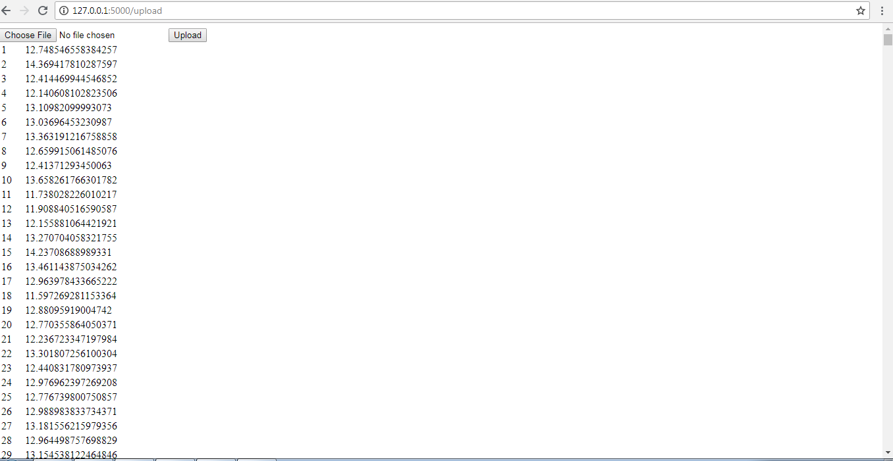

# sparsh
1. Download main dataset (i.e. 'DC_Properties.csv') from here: https://www.kaggle.com/christophercorrea/dc-residential-properties#DC_Properties.csv

2. Open IPython Notebook 'Recipient.ipynb' : Train the Model and export(pickle) the model(.pkl format)

3. Install Flask package (if not already installed) and go to http://127.0.0.1:5000/upload.

4. Upload the same 'DC_Properties.csv'(You can also upload new data with matching columns) file and click on upload button. Output will be displayed as shows in the screenshot here:

